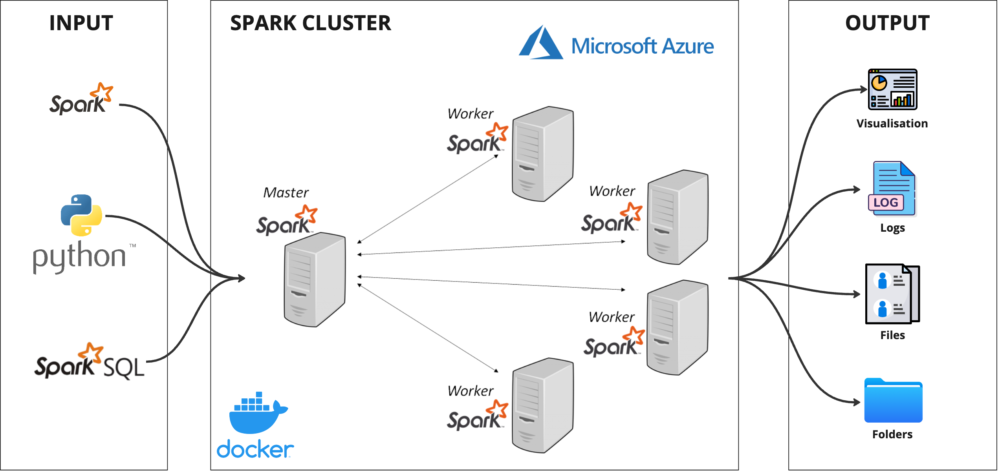

# Visa Data Analysis: Data Engineering
This project provides end-to-end data processing and visualization of visa numbers using PySpark and Plotly. The spark clusters are set up within a Docker container on Azure. This project has been created for learning purposes and has been replicated from the project initially done by Airscholar whose repo can be found here (https://github.com/airscholar/Japan-visa-data-engineering).

## 📝 Table of Contents
- [System Architecture](#system-architecture)
- [Setup & Requirements](#-setup--requirements)
- [Usage](#-usage)
- [Features](#-features)
- [Notes](#-notes)

## System Architecture

## 🛠 Setup & Requirements
1. **Azure Account**: An active Azure account.
2. **Docker**: The spark master & worker nodes are set up as different containers using Docker on an Azure VM.
3. **Python Libraries**: Used the following Python libraries:
   - PySpark
   - Plotly Express
   - pycountry
   - pycountry_convert
   - fuzzywuzzy

## 🚀 Usage
1. **Data Input**: Had placed the csv file `visa_number_in_japan.csv` in the `input` directory. The dataset was taken from Kaggle.
2. **Run the Script**: To execute the script, copy the scripts to the VM , run docker-compose, and submit the spark job to one of the workers using `docker exec -it ... spark-submit...`.
3. **Visualizations**: After execution, you'll find the visualizations saved as HTML files in the `output` directory.
4. **Cleaned Data**: The cleaned data will also be saved as a CSV file in the `output` directory.
   
## 📈 Features
- **System Architecture**: The Spark master-worker architecture is set up in a Docker container on Azure.
- **Data Ingestion**: The script ingests the CSV file containing the visa numbers.
- **Data Cleaning**: The script standardizes column names, drops null columns, and corrects country names using fuzzy matching.
- **Data Transformation**: The data is further enriched by adding continent information for each country.
- **Data Visualization**: The cleaned and transformed data is visualized using Plotly Express to provide insights into visa trends.
